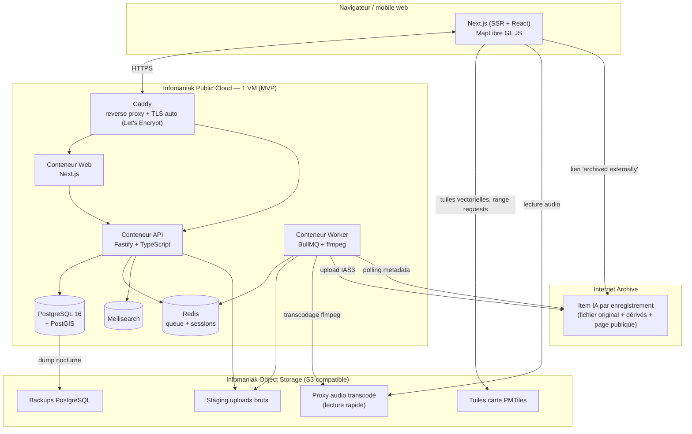

# 2. Architecture générale

## 2.1 Vue d'ensemble

## 2.2 Flux de lecture (le chemin le plus emprunté)

1. Le navigateur charge la page (SSR Next.js pour le SEO/perf initiale, hydratation ensuite).
2. La carte (Explorer) charge les tuiles vectorielles PMTiles directement depuis Object Storage/CDN via requêtes HTTP range — **aucun serveur de tuiles dédié requis**.
3. Au clic sur un marqueur, l'API renvoie les métadonnées de l'enregistrement (déjà en cache TanStack Query côté client si visité récemment).
4. La lecture audio pointe vers le **proxy transcodé** hébergé sur Object Storage Infomaniak (rapide, sous ton contrôle). Le lien « Original archived externally » pointe vers l'item Internet Archive (source pérenne, téléchargement du fichier original).

## 2.3 Flux d'upload (le chemin le moins fréquent, mais critique)

1. L'utilisateur dépose un fichier (Upload étape 1) → upload direct vers Object Storage (staging) via URL pré-signée, pas à travers l'API (évite de saturer un process Node avec un gros fichier binaire).
2. L'utilisateur saisit les métadonnées (étape 2) et choisit une licence (étape 3) → l'API crée l'enregistrement en base avec `status = 'processing'`.
3. Un job est poussé dans la queue Redis/BullMQ. Le worker :
   - valide le format/la durée avec `ffprobe` ;
   - génère les données de waveform (peaks) ;
   - transcode une version de lecture rapide (ex. Opus/MP3 128kbps) → Object Storage ;
   - pousse le fichier original + métadonnées vers Internet Archive (API IAS3) ;
   - interroge périodiquement l'item IA jusqu'à ce que les dérivés soient prêts ;
   - marque l'enregistrement `status = 'published'` et stocke les URLs finales.
4. Tant que `status != 'published'`, l'enregistrement n'apparaît pas publiquement (visible seulement par son auteur, avec un état "En cours d'archivage").

Détails complets : [05-stockage-audio-internet-archive.md](05-stockage-audio-internet-archive.md).

## 2.4 Pourquoi une seule VM au départ

Le MVP n'a pas de raison de dépasser le trafic qu'une seule VM correctement dimensionnée (4 vCPU / 8-16 Go RAM chez Infomaniak Public Cloud) peut absorber. Tous les services tournent en conteneurs Docker Compose sur cette VM, ce qui garde le déploiement simple (un `docker compose pull && up -d` via CI) tout en gardant une trajectoire claire vers plus de robustesse :

- **Étape suivante si charge/disponibilité l'exigent** : séparer la base de données sur une instance Infomaniak dédiée (ou base managée), ajouter une deuxième VM applicative derrière un load balancer Infomaniak.
- **Étape ultérieure si le trafic devient important** : migrer vers Infomaniak Kubernetes Engine, avec les mêmes images Docker (aucune réécriture applicative nécessaire, seulement le manifeste d'orchestration).

Voir [04-infra-infomaniak.md](04-infra-infomaniak.md) pour le détail du provisioning et cette trajectoire de scaling.
