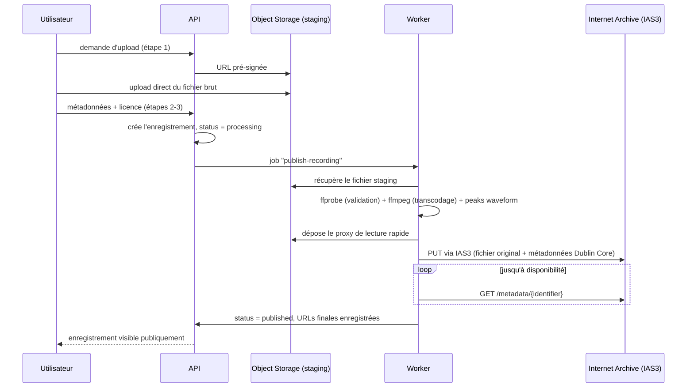

# 5. Stockage audio — Internet Archive

## 5.1 Pourquoi

Un enregistrement de terrain a une valeur documentaire indépendante du sort commercial ou technique d'Arborisis. Internet Archive (archive.org) offre un hébergement **gratuit et pérenne** pour du contenu librement licencié, avec sa propre infrastructure de réplication — c'est la meilleure garantie de pérennité disponible sans opérer soi-même un stockage distribué coûteux.

Point d'ailleurs déjà anticipé par le design : l'écran RecordingDetail prévoit un lien **« Original archived externally »** (§3.3 du [handoff](../design/handoff/DEV-HANDOFF.md)) — c'est exactement ce lien qui pointera vers l'item Internet Archive.

## 5.2 Répartition des responsabilités

> **Cible (une fois le seuil IA franchi, voir §5.10)** — tant que l'intégration Internet Archive n'est pas active, seule la colonne Infomaniak s'applique : voir §5.10 pour l'état réellement en place au démarrage.

| Rôle | Où | Pourquoi |
|---|---|---|
| **Copie pérenne / originale** (WAV/FLAC/MP3 tel qu'uploadé) | Internet Archive | archive de référence, indépendante d'Arborisis, publiquement téléchargeable |
| **Copie de lecture rapide** (transcodée, ex. Opus/MP3 128kbps) | Object Storage Infomaniak | latence maîtrisée pour la lecture in-app, résiste à une éventuelle lenteur/indisponibilité ponctuelle d'archive.org |
| **Métadonnées** (titre, lieu, tags, licence, durée, waveform peaks) | PostgreSQL (Infomaniak) | source de vérité applicative |

## 5.3 Pipeline d'upload → publication



Tant que `status != 'published'`, l'enregistrement n'est visible que par son auteur (état « En cours d'archivage » dans l'UI — à ajouter au design, non couvert par les mockups actuels).

> **Mode intérimaire actif (voir §5.10)** : les étapes `W->>IA` et la boucle de polling ci-dessus sont des no-op tant que `ARCHIVE_TO_IA=false`. Le worker passe directement de « dépose le proxy » à `status = published`, sans jamais contacter archive.org.

## 5.4 Détails techniques Internet Archive

- **API** : IAS3 (interface façon S3), endpoint `https://s3.us.archive.org`, authentifiée par clé/secret générés depuis le compte archive.org (`Account Settings → API Keys`).
- **Un item par enregistrement**, identifiant `arborisis-{uuid}` (stable, jamais réutilisé même si l'enregistrement est retiré côté Arborisis).
- **Métadonnées poussées en en-têtes `x-archive-meta-*`**, mappées depuis le modèle Dublin Core standard d'IA :

| Champ Arborisis | Champ IA (Dublin Core) |
|---|---|
| `title` | `title` |
| `description` | `description` |
| `location` (+ lat/long) | `coverage` |
| `tags[]` | `subject` |
| `recordedAt` | `date` |
| `license` (URL) | `licenseurl` |
| pseudo de l'auteur | `creator` |
| — | `collection` (voir §5.5) |

- **Dérivés asynchrones** : après upload, IA génère automatiquement des formats de streaming et une page publique — cela prend de quelques minutes à quelques heures. Le worker interroge `https://archive.org/metadata/{identifier}` en backoff exponentiel (via BullMQ) jusqu'à disponibilité des fichiers dérivés, sans bloquer l'utilisateur (il peut fermer l'onglet, la publication se termine en arrière-plan).

## 5.5 Licence — condition d'hébergement, pas juste une option UI

Internet Archive n'accepte que du contenu librement licencié ou du domaine public. Le sélecteur de licence déjà prévu à l'étape 3 du flux Ajouter ([Upload3.dc.html](../design/system/Upload3.dc.html)) doit donc être **restreint** à : `CC0`, `CC-BY`, `CC-BY-SA`, `CC-BY-NC` — jamais « tous droits réservés ». C'est une contrainte produit qui découle directement du choix d'hébergement, à documenter clairement dans l'UI (« Votre enregistrement sera archivé publiquement et durablement sur Internet Archive »), **dès que l'intégration IA sera active** (voir §5.10 — non active au démarrage du MVP).

**Action à démarrer tôt (phase 0 de la roadmap)** : demander la création d'une collection Internet Archive dédiée « Arborisis » (les collections personnalisées sont soumises à revue et peuvent prendre du temps). En attendant l'approbation, les items seraient normalement poussés dans une collection générique existante (ex. `opensource_audio`) puis migrés une fois la collection dédiée validée.

**Blocage constaté (2026-08-19)** : Internet Archive n'examine une demande de collection personnalisée qu'une fois qu'un volume minimal d'items (environ **50**) a déjà été publié par le compte demandeur dans une collection générique. Arborisis n'a par construction aucun item publié avant son lancement — ce seuil est donc impossible à atteindre *avant* d'avoir des utilisateurs réels, ce qui inverse la dépendance prévue par la roadmap initiale. Conséquence et repli retenus en §5.10.

## 5.6 Gestion des échecs

- Retry avec backoff exponentiel géré par BullMQ (3-5 tentatives) en cas d'échec de push IAS3 (timeout, indisponibilité ponctuelle).
- Si échec persistant : `status = 'failed'`, notification visible sur le profil de l'auteur (pas d'email — voir [06](06-authentification-sans-mot-de-passe.md)), avec bouton « Réessayer » manuel.
- Outil d'administration minimal (CLI ou route protégée) pour relancer un job bloqué.

## 5.7 Suppression et modération

Internet Archive décourage la suppression de contenu déjà archivé (c'est le principe même du service). Politique à afficher clairement au moment de la publication : la suppression d'un compte Arborisis retire le contenu de la plateforme Arborisis (profil, recherche, carte) mais **ne retire pas automatiquement** la copie déjà archivée sur Internet Archive, sauf demande légale justifiée (DMCA-like) traitée manuellement via le compte archive.org d'Arborisis. Détail complet : [10-securite-confidentialite-conformite.md](10-securite-confidentialite-conformite.md).

## 5.8 Modèle de données (ajouts)

```
recordings
├── status: 'draft' | 'processing' | 'published' | 'failed'
├── license: 'CC0' | 'CC-BY' | 'CC-BY-SA' | 'CC-BY-NC'
├── ia_identifier: string | null      -- null tant que le mode intérimaire (§5.10) est actif
├── ia_item_url: string | null        -- "Original archived externally" ; lien masqué en UI si null
├── original_url: string              -- Object Storage, préfixe originals/ (copie pérenne en mode intérimaire)
├── streaming_url: string             -- proxy Object Storage
└── waveform_peaks: number[]
```

## 5.9 À trancher

- Format de la copie de lecture rapide (Opus vs MP3 128kbps) — Opus est plus efficace mais MP3 a une compatibilité navigateur légèrement plus universelle sur les très vieux appareils ; recommandation : Opus avec fallback MP3 si besoin réel constaté.
- Faut-il purger le staging Object Storage après publication une fois IA actif (le fichier original vivra alors aussi sur IA) ? Recommandation : oui, purge à J+7 pour limiter les coûts de stockage. **Non applicable tant que le mode intérimaire (§5.10) est actif** : Object Storage est alors la seule copie durable, donc jamais purgée.

## 5.10 Mode intérimaire — repli sur Object Storage Infomaniak (pas d'Internet Archive au démarrage)

**Constat (voir §5.5)** : Internet Archive exige qu'un compte ait déjà publié un volume minimal d'items (≈ 50) avant d'examiner une demande de collection dédiée — et plus largement, avant d'y avoir un historique jugé légitime pour y pousser du contenu de façon fiable. Arborisis démarre à zéro : ce seuil est structurellement hors de portée avant le lancement. On ne bloque donc pas le développement produit sur une dépendance externe qu'on ne peut pas satisfaire par avance.

**Décision** : reporter entièrement l'intégration Internet Archive (Phase 2 de la roadmap) et faire reposer **tout** le stockage audio — original *et* copie de lecture — sur l'**Object Storage Infomaniak** (container `arborisis-storage`, déjà provisionné en Phase 0, voir [04-infra-infomaniak.md](04-infra-infomaniak.md)) pendant cette période. Concrètement :

| Rôle | Mode cible (§5.2) | Mode intérimaire (actif au démarrage) |
|---|---|---|
| Copie pérenne / originale | Internet Archive | **Object Storage Infomaniak**, préfixe `originals/`, jamais purgée |
| Copie de lecture rapide | Object Storage Infomaniak | Object Storage Infomaniak, préfixe `proxy/` (inchangé) |
| Lien « Original archived externally » (RecordingDetail) | pointe vers l'item IA | **masqué** tant que `ia_item_url` est `null` (voir §5.8) |
| Étape du pipeline « push IAS3 » (§5.3) | active | **désactivée** — le job `publish-recording` s'arrête après dépôt du proxy, `status` passe directement à `published` |

Ce mode ne change **rien** au schéma de données ni à l'API : `ia_identifier`/`ia_item_url` existent déjà en base et restent simplement `null` (voir §5.8). Le worker garde la structure de job prévue en §5.3, l'étape IA étant un no-op derrière un flag de configuration (`ARCHIVE_TO_IA=false` par défaut). Faire tourner ce flag à `true` plus tard n'exige donc **aucune migration ni réécriture** — seulement la mise en œuvre effective de l'étape IAS3 (Phase 2) une fois l'intégration prête.

**Limite assumée** : pendant tout ce mode, Arborisis est la *seule* copie durable des enregistrements (plus de garantie de pérennité indépendante de l'infra Infomaniak). Cela doit être documenté honnêtement dans l'UI/CGU (pas de mention « archivé sur Internet Archive » tant que le flag est désactivé) — voir aussi les sauvegardes Object Storage en [04.5](04-infra-infomaniak.md#45-sauvegardes), qui deviennent d'autant plus critiques dans cette période.

**Sortie du mode intérimaire** : une fois qu'Arborisis a organiquement accumulé assez d'enregistrements publiés (viser 50+, cohérent avec le seuil constaté), relancer la démarche §5.5 (demande de collection dédiée ou, à défaut, push dans une collection générique existante type `opensource_audio`), puis activer `ARCHIVE_TO_IA=true` et lancer un job de rattrapage qui pousse vers IA l'historique déjà publié.

**Stockage sous-jacent — Object Storage vs Block Storage Infomaniak** : Infomaniak Public Cloud propose deux types de stockage distincts (voir [04.1](04-infra-infomaniak.md#41-pourquoi-infomaniak)). Le choix retenu ici est l'**Object Storage** (compatible API S3, déjà provisionné par Terraform, accessible directement par l'API/le worker sans dépendre de la VM) et non un volume Block Storage attaché à la VM (qui imposerait un point de montage unique, un système de fichiers à gérer, et ne serait pas nativement accessible en HTTP pour la copie de lecture). Un volume Block Storage reste pertinent en complément, en tant que **cible de sauvegarde secondaire** (snapshots) plutôt que comme stockage primaire des fichiers audio — décision cohérente avec [04.5](04-infra-infomaniak.md#45-sauvegardes).
