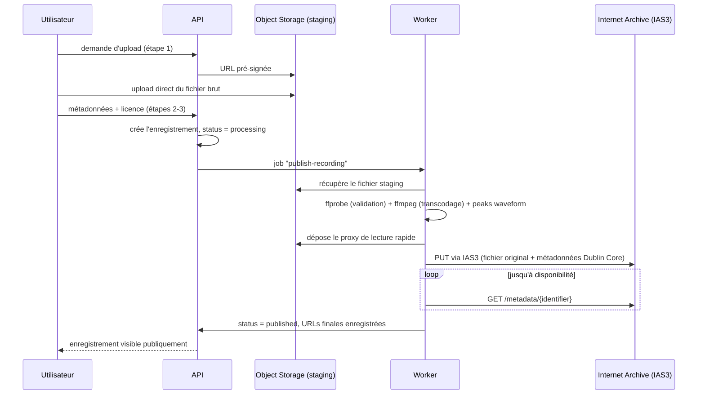

# 5. Stockage audio — Internet Archive

## 5.1 Pourquoi

Un enregistrement de terrain a une valeur documentaire indépendante du sort commercial ou technique d'Arborisis. Internet Archive (archive.org) offre un hébergement **gratuit et pérenne** pour du contenu librement licencié, avec sa propre infrastructure de réplication — c'est la meilleure garantie de pérennité disponible sans opérer soi-même un stockage distribué coûteux.

Point d'ailleurs déjà anticipé par le design : l'écran RecordingDetail prévoit un lien **« Original archived externally »** (§3.3 du [handoff](../design/handoff/DEV-HANDOFF.md)) — c'est exactement ce lien qui pointera vers l'item Internet Archive.

## 5.2 Répartition des responsabilités

| Rôle | Où | Pourquoi |
|---|---|---|
| **Copie pérenne / originale** (WAV/FLAC/MP3 tel qu'uploadé) | Internet Archive | archive de référence, indépendante d'Arborisis, publiquement téléchargeable |
| **Copie de lecture rapide** (transcodée, ex. Opus/MP3 128kbps) | Object Storage Infomaniak | latence maîtrisée pour la lecture in-app, résiste à une éventuelle lenteur/indisponibilité ponctuelle d'archive.org |
| **Métadonnées** (titre, lieu, tags, licence, durée, waveform peaks) | PostgreSQL (Infomaniak) | source de vérité applicative |

## 5.3 Pipeline d'upload → publication



Tant que `status != 'published'`, l'enregistrement n'est visible que par son auteur (état « En cours d'archivage » dans l'UI — à ajouter au design, non couvert par les mockups actuels).

## 5.4 Détails techniques Internet Archive

- **API** : IAS3 (interface façon S3), endpoint `https://s3.us.archive.org`, authentifiée par clé/secret générés depuis le compte archive.org (`Account Settings → API Keys`).
- **Un item par enregistrement**, identifiant `arborisis-{uuid}` (stable, jamais réutilisé même si l'enregistrement est retiré côté Arborisis).
- **Métadonnées poussées en en-têtes `x-archive-meta-*`**, mappées depuis le modèle Dublin Core standard d'IA :

| Champ Arborisis | Champ IA (Dublin Core) |
|---|---|
| `title` | `title` |
| `description` | `description` |
| `location` (+ lat/long) | `coverage` |
| `tags[]` | `subject` |
| `recordedAt` | `date` |
| `license` (URL) | `licenseurl` |
| pseudo de l'auteur | `creator` |
| — | `collection` (voir §5.5) |

- **Dérivés asynchrones** : après upload, IA génère automatiquement des formats de streaming et une page publique — cela prend de quelques minutes à quelques heures. Le worker interroge `https://archive.org/metadata/{identifier}` en backoff exponentiel (via BullMQ) jusqu'à disponibilité des fichiers dérivés, sans bloquer l'utilisateur (il peut fermer l'onglet, la publication se termine en arrière-plan).

## 5.5 Licence — condition d'hébergement, pas juste une option UI

Internet Archive n'accepte que du contenu librement licencié ou du domaine public. Le sélecteur de licence déjà prévu à l'étape 3 du flux Ajouter ([Upload3.dc.html](../design/system/Upload3.dc.html)) doit donc être **restreint** à : `CC0`, `CC-BY`, `CC-BY-SA`, `CC-BY-NC` — jamais « tous droits réservés ». C'est une contrainte produit qui découle directement du choix d'hébergement, à documenter clairement dans l'UI (« Votre enregistrement sera archivé publiquement et durablement sur Internet Archive »).

**Action à démarrer tôt (phase 0 de la roadmap)** : demander la création d'une collection Internet Archive dédiée « Arborisis » (les collections personnalisées sont soumises à revue et peuvent prendre du temps). En attendant l'approbation, les items sont poussés dans une collection générique existante (ex. `opensource_audio`) puis migrés une fois la collection dédiée validée.

## 5.6 Gestion des échecs

- Retry avec backoff exponentiel géré par BullMQ (3-5 tentatives) en cas d'échec de push IAS3 (timeout, indisponibilité ponctuelle).
- Si échec persistant : `status = 'failed'`, notification visible sur le profil de l'auteur (pas d'email — voir [06](06-authentification-sans-mot-de-passe.md)), avec bouton « Réessayer » manuel.
- Outil d'administration minimal (CLI ou route protégée) pour relancer un job bloqué.

## 5.7 Suppression et modération

Internet Archive décourage la suppression de contenu déjà archivé (c'est le principe même du service). Politique à afficher clairement au moment de la publication : la suppression d'un compte Arborisis retire le contenu de la plateforme Arborisis (profil, recherche, carte) mais **ne retire pas automatiquement** la copie déjà archivée sur Internet Archive, sauf demande légale justifiée (DMCA-like) traitée manuellement via le compte archive.org d'Arborisis. Détail complet : [10-securite-confidentialite-conformite.md](10-securite-confidentialite-conformite.md).

## 5.8 Modèle de données (ajouts)

```
recordings
├── status: 'draft' | 'processing' | 'published' | 'failed'
├── license: 'CC0' | 'CC-BY' | 'CC-BY-SA' | 'CC-BY-NC'
├── ia_identifier: string | null
├── ia_item_url: string | null        -- "Original archived externally"
├── streaming_url: string             -- proxy Object Storage
└── waveform_peaks: number[]
```

## 5.9 À trancher

- Format de la copie de lecture rapide (Opus vs MP3 128kbps) — Opus est plus efficace mais MP3 a une compatibilité navigateur légèrement plus universelle sur les très vieux appareils ; recommandation : Opus avec fallback MP3 si besoin réel constaté.
- Faut-il purger le staging Object Storage après publication (le fichier original vit déjà sur IA) ? Recommandation : oui, purge à J+7 pour limiter les coûts de stockage, IA restant la source de l'original.
