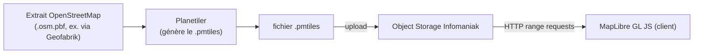

# 7. Carte — 100% open source, zéro API payante

> Contrainte explicite : la carte doit reposer entièrement sur des briques open source, sans clé d'API payante nulle part dans la chaîne (rendu, tuiles, géocodage).

## 7.1 Panorama des briques et pourquoi chacune respecte la contrainte

| Besoin | Choix | Licence | Clé API requise ? |
|---|---|---|---|
| Rendu carte (client) | **MapLibre GL JS** | BSD-3 | Non — fork open source de Mapbox GL JS créé précisément quand Mapbox est passé payant/propriétaire en 2020 |
| Données géographiques | **OpenStreetMap** (extraction régionale ou planétaire) | ODbL | Non — données ouvertes, contribuées par la communauté |
| Génération des tuiles vectorielles | **Planetiler** (outil open source, ex-employé Mapbox/Meta) | Apache-2.0 | Non — tourne en local/CI à partir d'un extrait `.osm.pbf` |
| Format de tuiles | **PMTiles** (spec + outils Protomaps) | BSD-3 | Non — un seul fichier statique servi par HTTP range requests, aucun serveur de tuiles dédié |
| Style visuel de la carte | Style JSON MapLibre custom, écrit à la main pour coller à l'esthétique « Quiet Cartography » | — | Non |
| Géocodage (recherche de lieu, autocomplete Upload étape 2) | **Nominatim** ou **Photon** (basés sur les données OSM) | GPLv2 (Nominatim) / Apache-2.0 (Photon) | Non |
| Clustering des marqueurs | **Supercluster** (bibliothèque JS de Mapbox, open source, utilisable indépendamment du service Mapbox) | ISC | Non |

Aucune de ces briques ne nécessite de compte, de facturation à l'usage ou de token — toute la chaîne peut tourner sans qu'aucune requête ne quitte l'infrastructure que tu contrôles (une fois auto-hébergée, voir §7.4).

## 7.2 Pourquoi PMTiles plutôt qu'un serveur de tuiles

Un serveur de tuiles classique (tileserver-gl, Martin…) est un service à faire tourner, superviser, scaler. **PMTiles** évite ça : c'est un format de fichier unique (un `.pmtiles` de quelques centaines de Mo à quelques Go selon l'emprise géographique couverte) qui s'interroge directement via des requêtes HTTP `Range`, exactement comme MapLibre sait le lire nativement (`pmtiles://` protocole). Le fichier est simplement déposé sur l'Object Storage Infomaniak (§4) — pas de conteneur applicatif dédié, pas de point de défaillance supplémentaire.

## 7.3 Pipeline de génération des tuiles

- Génération **hors ligne / en CI**, pas en temps réel : un job planifié (ex. mensuel, ou déclenché manuellement) régénère le fichier si l'emprise géographique doit évoluer.
- Emprise de départ : pas besoin de couvrir toute la planète en détail élevé au MVP — extraire uniquement les régions où des enregistrements sont attendus dans les premiers mois, avec un fallback bas-niveau-de-détail mondial (léger) pour le zoom out. Ajuster au fil de la croissance de la communauté de contributeurs.
- Script reproductible versionné dans `infra/tiles/` (commande Planetiler + upload), pas une opération manuelle non documentée.

## 7.4 Bootstrap vs auto-hébergement complet

Pour ne pas bloquer le tout début du développement sur la génération de tuiles, deux options existent, dans l'esprit du principe « réversibilité » de [01-vision-et-principes.md](01-vision-et-principes.md#14-ce-que-ces-principes-autorisent-avec-discernement) :

- **Phase de développement (bootstrap)** : utiliser un build public gratuit du projet Protomaps (basemap mondial déjà généré, mis à jour périodiquement par le projet, servi par Protomaps ou un miroir) pour itérer vite sur le style et l'intégration MapLibre. Toujours gratuit, toujours sans clé API — mais reste une dépendance à un tiers pour la disponibilité du fichier.
- **Production (cible)** : fichier `.pmtiles` généré par toi via Planetiler et servi depuis l'Object Storage Infomaniak — indépendance totale, alignée avec le principe de pérennité.

Le switch entre les deux n'est qu'un changement d'URL dans la config MapLibre (`pmtiles://https://tiles.arborisis.com/basemap.pmtiles`) — aucun changement de code.

## 7.5 Géocodage (recherche de lieu à l'upload)

Pour le champ Location de l'étape 2 du flux Ajouter ([Upload2.dc.html](../design/system/Upload2.dc.html)) :

- **Photon** (par komoot) est recommandé pour l'auto-hébergement : plus simple à opérer que Nominatim (index Lucene autonome plutôt que PostgreSQL + `osm2pgsql` avec des besoins disque importants), tout en restant basé sur les données OSM.
- **Bootstrap** : l'instance publique de démonstration de Photon (gratuite, sans clé) peut servir en développement, avec migration vers une instance auto-hébergée avant le lancement public pour ne dépendre d'aucun tiers en production — même logique qu'en §7.4.

## 7.6 Style visuel

Le style MapLibre (fichier JSON) est écrit à la main pour reproduire le rendu « contours fins, absence de tuiles satellite saturées, marqueurs discrets » demandé par le handoff design (§3.1) : palette limitée à `--color-ink`/`--color-paper`/`--line-*`, pas de labels de rues en surcharge, routes et bâtiments très atténués pour laisser la priorité visuelle aux marqueurs d'enregistrements. Ce style est un artefact versionné dans `apps/web/map-style/`, pas un style tiers importé.

## 7.7 À trancher

- Emprise géographique initiale du fichier `.pmtiles` de production (dépend des premières zones où la communauté est attendue).
- Nominatim vs Photon pour l'auto-hébergement définitif — Photon recommandé par défaut pour sa simplicité opérationnelle, à revalider si des besoins de recherche plus fins (adresses précises) apparaissent.
